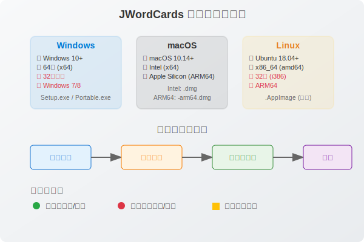

# 📋 系统兼容性检查指南

本指南将帮助您确定适合您系统的 JWordCards 安装包。

## 🖥️ 如何检查您的操作系统

###  Windows 用户

#### 方法一：通过设置检查
1. 按 `Win + I` 打开设置
2. 点击「系统」→「关于」
3. 查看「Windows 规格」部分

| 状态 | 说明 |
|------|------|
|  | 支持的版本：Windows 10 (1903+) 或 Windows 11 |
|  | 支持的架构：64位 (x64) |
|  | 不支持：Windows 7/8/8.1, 32位系统 |

#### 方法二：通过命令行检查
1. 按 `Win + R`，输入 `cmd`
2. 运行以下命令：
```bash
systeminfo | findstr /B /C:"OS Name" /C:"System Type"
```

#### 推荐安装包
- **安装版**：`JWordCards Setup 1.0.0.exe` (推荐)
- **便携版**：`JWordCards 1.0.0.exe` (无需安装)

---

###  macOS 用户

#### 检查 macOS 版本
1. 点击左上角 🍎 苹果菜单
2. 选择「关于本机」
3. 查看 macOS 版本信息

| 状态 | 说明 |
|------|------|
|  | 支持的版本：macOS 10.14 (Mojave) 或更高 |
|  | 支持的架构：Intel 和 Apple Silicon (M1/M2/M3) |

#### 检查处理器类型
在「关于本机」窗口中查看「处理器」或「芯片」信息：

**Intel Mac 标识：**
- Intel Core i3/i5/i7/i9
- Intel Xeon

**Apple Silicon Mac 标识：**
- Apple M1
- Apple M1 Pro/Max/Ultra
- Apple M2
- Apple M2 Pro/Max/Ultra
- Apple M3
- Apple M3 Pro/Max

#### 推荐安装包
- **Intel Mac**：`JWordCards-1.0.0.dmg`
- **Apple Silicon Mac**：`JWordCards-1.0.0-arm64.dmg`

> 💡 **提示**：Apple Silicon Mac 也可以运行 Intel 版本（通过 Rosetta 2），但原生 ARM64 版本性能更好。

---

###  Linux 用户

#### 检查发行版和架构
打开终端，运行以下命令：

```bash
# 检查发行版
lsb_release -a
# 或者
cat /etc/os-release

# 检查架构
uname -m
```

#### 支持的发行版
| 状态 | 发行版 |
|------|--------|
|  | Ubuntu 18.04+ |
|  | Debian 10+ |
|  | CentOS 7+ |
|  | Fedora 30+ |
|  | openSUSE Leap 15+ |
|  | Arch Linux |
|  | 其他现代 Linux 发行版 |

#### 支持的架构
| 状态 | 架构 |
|------|------|
|  | x86_64 (amd64) |
|  | 不支持：32位 (i386), ARM64 |

#### 推荐安装包
- **通用版** (推荐)：`JWordCards-1.0.0.AppImage`
- **Debian/Ubuntu**：`jwordcards_1.0.0_amd64.deb` (如果可用)
- **RedHat/CentOS**：`jwordcards-1.0.0.x86_64.rpm` (如果可用)

---

## 🔍 快速系统检测

### 自动检测脚本

您可以使用以下脚本快速检测系统信息：

#### Windows (PowerShell)
```powershell
# 保存为 check-system.ps1
Write-Host "=== JWordCards 系统兼容性检查 ===" -ForegroundColor Green
Write-Host "操作系统: $((Get-WmiObject Win32_OperatingSystem).Caption)"
Write-Host "架构: $((Get-WmiObject Win32_OperatingSystem).OSArchitecture)"
Write-Host "版本: $((Get-WmiObject Win32_OperatingSystem).Version)"

$os = (Get-WmiObject Win32_OperatingSystem)
if ($os.Caption -match "Windows 10|Windows 11" -and $os.OSArchitecture -eq "64-bit") {
    Write-Host "✓ 您的系统支持 JWordCards" -ForegroundColor Green
    Write-Host "推荐下载: JWordCards Setup 1.0.0.exe" -ForegroundColor Yellow
} else {
    Write-Host "✗ 您的系统可能不支持 JWordCards" -ForegroundColor Red
}
```

#### macOS/Linux (Bash)
```bash
#!/bin/bash
# 保存为 check-system.sh
echo "=== JWordCards 系统兼容性检查 ==="

if [[ "$OSTYPE" == "darwin"* ]]; then
    echo "操作系统: macOS"
    echo "版本: $(sw_vers -productVersion)"
    echo "架构: $(uname -m)"
    
    if [[ "$(uname -m)" == "arm64" ]]; then
        echo "✓ 检测到 Apple Silicon Mac"
        echo "推荐下载: JWordCards-1.0.0-arm64.dmg"
    else
        echo "✓ 检测到 Intel Mac"
        echo "推荐下载: JWordCards-1.0.0.dmg"
    fi
elif [[ "$OSTYPE" == "linux-gnu"* ]]; then
    echo "操作系统: Linux"
    echo "发行版: $(lsb_release -d 2>/dev/null | cut -f2 || cat /etc/os-release | grep PRETTY_NAME | cut -d'"' -f2)"
    echo "架构: $(uname -m)"
    
    if [[ "$(uname -m)" == "x86_64" ]]; then
        echo "✓ 您的系统支持 JWordCards"
        echo "推荐下载: JWordCards-1.0.0.AppImage"
    else
        echo "✗ 不支持的架构: $(uname -m)"
    fi
fi
```

---

## 📊 兼容性对照表

### 系统架构支持概览

<div align="center">
  
</div>

### 详细兼容性表格

| 操作系统 | 最低版本 | 架构 | 推荐安装包 | 状态 | 备注 |
|---------|---------|------|-----------|------|------|
|  Windows | 10 (1903+) | x64 | `JWordCards Setup 1.0.0.exe` |  | 推荐安装版 |
|  Windows | 10 (1903+) | x64 | `JWordCards 1.0.0.exe` |  | 便携版 |
|  macOS | 10.14+ | Intel | `JWordCards-1.0.0.dmg` |  | Intel 处理器 |
|  macOS | 10.14+ | ARM64 | `JWordCards-1.0.0-arm64.dmg` |  | Apple Silicon |
|  Linux | Ubuntu 18.04+ | x64 | `JWordCards-1.0.0.AppImage` |  | 通用格式 |
|  Linux | Debian 10+ | x64 | `jwordcards_1.0.0_amd64.deb` |  | 需要额外配置 |
|  Linux | CentOS 7+ | x64 | `jwordcards-1.0.0.x86_64.rpm` |  | 需要额外配置 |

---

## ❓ 常见问题

### Q: 我的系统版本较老，能运行 JWordCards 吗？
A: 请参考上述最低系统要求。如果您的系统版本过老，建议先升级系统。

### Q: Apple Silicon Mac 可以运行 Intel 版本吗？
A: 可以，通过 Rosetta 2 兼容层运行，但推荐使用原生 ARM64 版本以获得更好性能。

### Q: Linux 下 AppImage 和 deb/rpm 有什么区别？
A: 
- **AppImage**: 便携式，无需安装，兼容性最好
- **deb/rpm**: 需要安装，集成度更好，但可能需要额外配置

### Q: 如何验证下载的安装包？
A: 检查文件大小是否合理（通常 100-200MB），确保从官方渠道下载。

---

## 🚀 安装后验证

安装完成后，您可以通过以下方式验证应用是否正常运行：

1. **启动应用**：确保应用能正常启动
2. **检查功能**：测试基本的单词卡片功能
3. **主题切换**：验证亮色/暗色主题切换
4. **窗口调整**：测试窗口大小调整功能
5. **数据持久化**：关闭重开应用，检查设置是否保存

如果遇到问题，请检查系统日志或联系技术支持。

---

*最后更新：2025年7月*